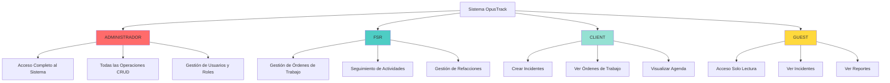
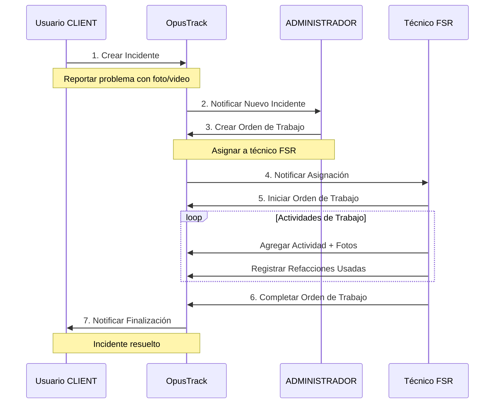
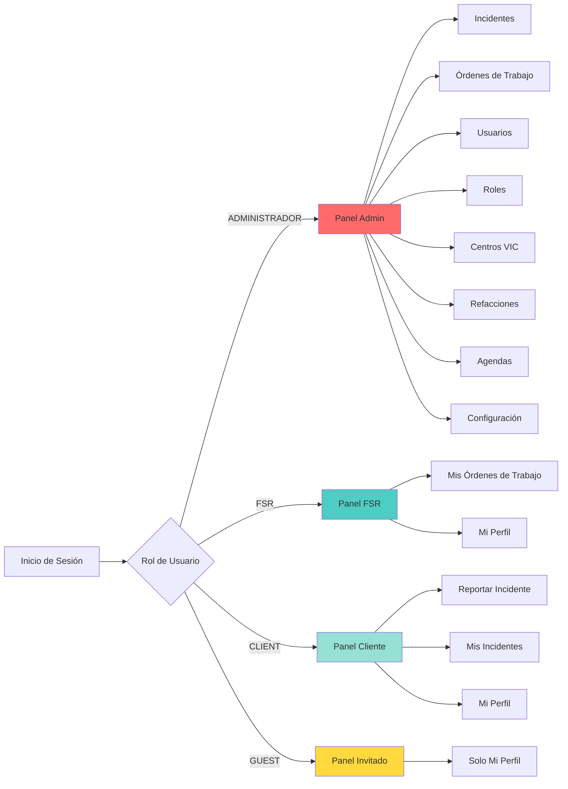
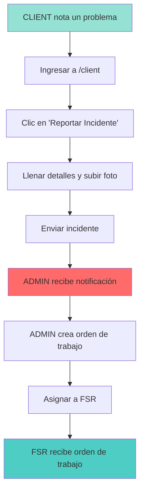
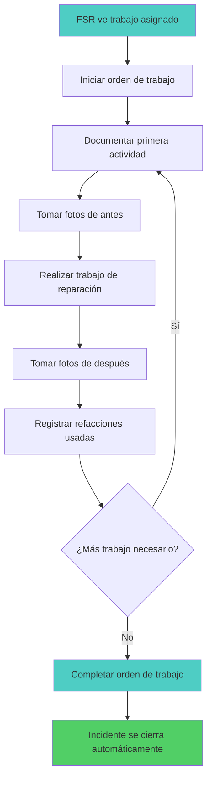
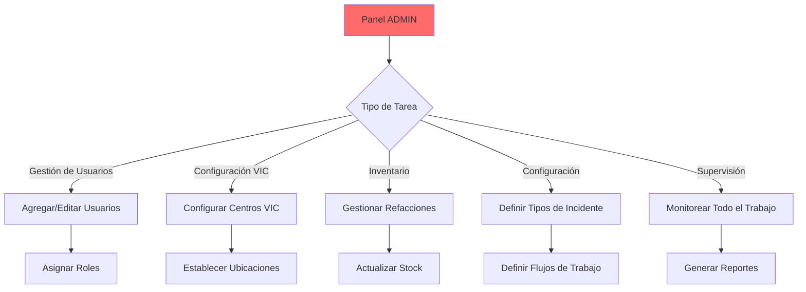

# Guía de Demostración del Sistema OpusTrack

**Sistema de Gestión de Incidentes y Órdenes de Trabajo para Centros de Verificación Vehicular**

---

## 🎯 Descripción General del Sistema

OpusTrack es un sistema profesional de gestión de incidentes y seguimiento de órdenes de trabajo diseñado específicamente para Centros de Verificación Vehicular (VIC) en México. El sistema proporciona gestión completa del ciclo de vida desde el reporte de incidentes hasta la finalización de órdenes de trabajo.

### Características Principales

- 🔒 **Control de Acceso Basado en Roles** - 4 roles de usuario distintos con permisos granulares
- 📱 **Diseño Responsivo** - Adaptable a móviles con captura de fotos
- 📊 **Seguimiento en Tiempo Real** - Monitoreo de incidentes y órdenes de trabajo
- 📎 **Archivos Adjuntos** - Carga de fotos, videos y documentos (soporte HEIC para iPhone)
- 🔄 **Flujo de Trabajo Completo** - Desde la creación del incidente hasta su resolución
- 🌓 **Modo Oscuro/Claro** - Cambio de tema para mejor experiencia visual
- 🔍 **Búsqueda y Filtros** - Encuentra rápidamente incidentes y órdenes de trabajo
- 📋 **Paginación Inteligente** - Navegación eficiente en tablas grandes

---

## 👥 Roles de Usuario y Niveles de Acceso



### Descripción de Roles

| Rol               | Nivel de Acceso | Caso de Uso Principal                          | Asociación VIC           |
| ----------------- | --------------- | ---------------------------------------------- | ------------------------ |
| **ADMINISTRADOR** | Acceso Total    | Configuración del sistema, gestión de usuarios | ❌ No específico del VIC |
| **FSR**           | Gestión         | Servicio de campo, ejecución de trabajo        | ✅ Asignado a VIC        |
| **CLIENT**        | Crear y Ver     | Reportar incidentes, seguir progreso           | ✅ De VIC específico     |
| **GUEST**         | Solo Lectura    | Acceso de visualización, reportes              | ❌ No específico del VIC |

---

## 🔄 Flujo de Trabajo del Sistema



---

## 📋 Funcionalidades por Rol de Usuario

### 🔴 ADMINISTRADOR (Administrador)

**Panel de Control:** `/admin`

**Control Total del Sistema** - Acceso completo a todas las funcionalidades

#### Gestión de Incidentes

- ✅ Ver todos los incidentes de todos los VICs
- ✅ Crear, editar y eliminar incidentes
- ✅ Asignar incidentes a técnicos FSR
- ✅ Actualizar estado y prioridad de incidentes
- ✅ Ver historial completo de incidentes
- ✅ **Tabla responsiva con paginación** (10/25/50/100 elementos por página)
- ✅ **Filtros avanzados** por estado, prioridad, tipo y VIC
- ✅ **Búsqueda rápida** por título o descripción

#### Gestión de Órdenes de Trabajo

- ✅ Crear órdenes de trabajo desde incidentes
- ✅ Asignar órdenes de trabajo a técnicos FSR
- ✅ Monitorear progreso de órdenes de trabajo
- ✅ Ver todas las actividades y refacciones usadas
- ✅ Marcar órdenes de trabajo como completadas
- ✅ **Tabla responsiva** con información condensada en móviles
- ✅ **Ver archivos adjuntos** (fotos, videos, documentos)

#### Configuración del Sistema

- ✅ Gestionar usuarios (crear, editar, desactivar)
- ✅ Configurar roles y permisos
- ✅ Gestionar centros VIC
- ✅ Configurar tipos y estados de incidentes
- ✅ Gestionar inventario de refacciones
- ✅ Configurar agendas
- ✅ **Ver incidentes programados** en detalles de agenda
- ✅ **Tabla de roles responsiva** con paginación

#### Páginas Principales

- `/admin` - Panel principal con estadísticas
- `/admin/incidents` - Todos los incidentes (tabla paginada y responsiva)
- `/admin/work-orders` - Todas las órdenes de trabajo
- `/admin/users` - Gestión de usuarios
- `/admin/roles` - Configuración de roles (con paginación)
- `/admin/vic-centers` - Gestión de VIC
- `/admin/parts` - Gestión de inventario
- `/admin/schedules` - Planificación de agenda
- `/admin/schedules/[id]` - Ver incidentes programados para fecha específica

---

### 🔵 FSR (Representante de Servicio de Campo)

**Panel de Control:** `/fsr`

**Operaciones de Campo** - Ejecutar y dar seguimiento a órdenes de trabajo

#### Ejecución de Órdenes de Trabajo

- ✅ Ver órdenes de trabajo asignadas
- ✅ Iniciar órdenes de trabajo
- ✅ Agregar actividades de trabajo con descripciones
- ✅ Subir evidencia (fotos, videos, documentos)
- ✅ Registrar refacciones usadas
- ✅ Completar órdenes de trabajo
- ✅ **Interfaz optimizada para trabajo en campo**

#### Seguimiento de Actividades

- ✅ Documentar todo el trabajo realizado
- ✅ Adjuntar fotos de antes y después
- ✅ Registrar tiempo invertido en actividades
- ✅ Actualizar estado del trabajo en tiempo real
- ✅ **Vista móvil mejorada** para trabajo en sitio

#### Gestión de Refacciones

- ✅ Ver refacciones disponibles
- ✅ Registrar refacciones usadas en reparaciones
- ✅ Seguimiento de cantidad y costos
- ✅ Actualizar inventario de refacciones

#### Visualización de Incidentes

- ✅ Ver incidentes relacionados
- ✅ Actualizar progreso del incidente
- ✅ Acceder a detalles e historial del incidente

#### Páginas Principales

- `/fsr` - Panel de órdenes de trabajo asignadas
- `/fsr/work-orders` - Mis órdenes de trabajo
- `/fsr/work-orders/[id]` - Ejecutar orden de trabajo
- `/profile` - Gestión de perfil

#### Características Móviles

- 📱 Tomar fotos directamente desde la cámara del teléfono
- 📱 Soporte para formato HEIC (formato nativo de iPhone)
- 📱 Subir videos desde campo
- 📱 Actualizaciones en tiempo real mientras trabaja
- 📱 **Diseño responsivo** optimizado para pantallas pequeñas

---

### 🟢 CLIENT (Usuario Cliente)

**Panel de Control:** `/client`

**Reporte de Incidentes** - Reportar y dar seguimiento a problemas

#### Creación de Incidentes

- ✅ Crear nuevos incidentes
- ✅ Describir detalles del problema
- ✅ Establecer nivel de prioridad
- ✅ Subir fotos/videos del problema
- ✅ Asociar con ubicación VIC
- ✅ **Seleccionar tipo de incidente** desde catálogo

#### Seguimiento

- ✅ **Ver SOLO mis incidentes reportados** (filtrado por usuario)
- ✅ Seguir estado del incidente
- ✅ Ver órdenes de trabajo asignadas
- ✅ Ver actualizaciones de progreso
- ✅ Ver detalles de resolución
- ✅ **Dashboard con estadísticas** personalizadas
- ✅ **Tarjetas de resumen** (Total, Abiertos, En Progreso, Cerrados)

#### Órdenes de Trabajo

- ✅ Ver órdenes de trabajo relacionadas a mis incidentes
- ✅ Ver técnicos asignados
- ✅ Ver actividades de trabajo realizadas
- ✅ Verificar refacciones usadas y costos

#### Páginas Principales

- `/client` - Panel de mis incidentes con estadísticas
- `/client/new` - Reportar nuevo incidente
- `/client/incidents/[id]` - Ver detalles del incidente

#### Seguridad y Privacidad

- 🔒 **Aislamiento de datos** - Solo ve sus propios incidentes
- 🔒 **Filtrado por usuario** - No puede ver incidentes de otros clientes
- 🔒 **Permisos específicos** - Acceso controlado a recursos

---

### 🟡 GUEST (Invitado/Personal)

**Panel de Control:** `/guest`

**Acceso Solo Lectura** - Visualización limitada

#### Acceso Actual

- ✅ Ver y editar su propio perfil
- ✅ Cambiar su contraseña
- ✅ Actualizar información de contacto
- ⚠️ **Acceso limitado** a otras funcionalidades

#### Lo que GUEST NO Puede Hacer

- ❌ Ver incidentes
- ❌ Ver órdenes de trabajo
- ❌ Acceder a inventario de refacciones
- ❌ Ver agendas
- ❌ Crear o modificar cualquier dato

#### Casos de Uso

- Tipo de cuenta temporal para incorporación
- Expansión futura para:
  - Supervisión gerencial
  - Reportes y análisis
  - Auditoría
  - Capacitación y observación

#### Páginas Principales

- `/guest` - Panel con mensaje de restricción de acceso
- `/profile` - Gestión de perfil (única página accesible)

---

## 🗺️ Mapa de Navegación del Sistema



---

## 📊 Matriz Completa de Permisos

| Funcionalidad                | ADMINISTRADOR | FSR          | CLIENT          | GUEST |
| ---------------------------- | ------------- | ------------ | --------------- | ----- |
| **Incidentes**               |
| Ver Incidentes               | ✅ Todos      | ✅ Todos     | ✅ Solo propios | ❌    |
| Crear Incidentes             | ✅            | ❌           | ✅ Solo su VIC  | ❌    |
| Editar Incidentes            | ✅            | ✅           | ❌              | ❌    |
| Eliminar Incidentes          | ✅            | ❌           | ❌              | ❌    |
| Asignar Incidentes           | ✅            | ❌           | ❌              | ❌    |
| Cerrar Incidentes            | ✅            | ❌           | ❌              | ❌    |
| **Órdenes de Trabajo**       |
| Ver Órdenes                  | ✅ Todas      | ✅ Asignadas | ✅ Relacionadas | ❌    |
| Crear Órdenes                | ✅            | ❌           | ❌              | ❌    |
| Editar Órdenes               | ✅            | ✅ Asignadas | ❌              | ❌    |
| Eliminar Órdenes             | ✅            | ❌           | ❌              | ❌    |
| Asignar Órdenes              | ✅            | ❌           | ❌              | ❌    |
| Completar Órdenes            | ✅            | ✅           | ❌              | ❌    |
| **Actividades de Trabajo**   |
| Ver Actividades              | ✅            | ✅           | ✅ Relacionadas | ❌    |
| Crear Actividades            | ✅            | ✅           | ❌              | ❌    |
| Editar Actividades           | ✅            | ✅ Propias   | ❌              | ❌    |
| Eliminar Actividades         | ✅            | ✅ Propias   | ❌              | ❌    |
| Subir Archivos               | ✅            | ✅           | ❌              | ❌    |
| **Refacciones e Inventario** |
| Ver Refacciones              | ✅            | ✅           | ❌              | ❌    |
| Crear Refacciones            | ✅            | ❌           | ❌              | ❌    |
| Editar Refacciones           | ✅            | ❌           | ❌              | ❌    |
| Eliminar Refacciones         | ✅            | ❌           | ❌              | ❌    |
| Registrar Uso                | ✅            | ✅           | ❌              | ❌    |
| **Gestión de Perfil**        |
| Ver Propio Perfil            | ✅            | ✅           | ✅              | ✅    |
| Editar Propio Perfil         | ✅            | ✅           | ✅              | ✅    |
| Cambiar Contraseña           | ✅            | ✅           | ✅              | ✅    |
| **Usuarios y Configuración** |
| Ver Usuarios                 | ✅            | ❌           | ❌              | ❌    |
| Crear Usuarios               | ✅            | ❌           | ❌              | ❌    |
| Editar Usuarios              | ✅            | ❌           | ❌              | ❌    |
| Eliminar Usuarios            | ✅            | ❌           | ❌              | ❌    |
| Gestionar Roles              | ✅            | ❌           | ❌              | ❌    |
| Gestionar Permisos           | ✅            | ❌           | ❌              | ❌    |
| Gestionar VICs               | ✅            | ❌           | ❌              | ❌    |
| **Agendas**                  |
| Ver Agendas                  | ✅            | ✅           | ✅              | ❌    |
| Ver Incidentes en Agenda     | ✅            | ❌           | ❌              | ❌    |
| Crear Agendas                | ✅            | ❌           | ❌              | ❌    |
| Editar Agendas               | ✅            | ❌           | ❌              | ❌    |
| Eliminar Agendas             | ✅            | ❌           | ❌              | ❌    |
| **Tipos de Incidente**       |
| Ver Tipos                    | ✅            | ❌           | ✅ (para crear) | ❌    |
| Crear Tipos                  | ✅            | ❌           | ❌              | ❌    |
| Editar Tipos                 | ✅            | ❌           | ❌              | ❌    |
| Eliminar Tipos               | ✅            | ❌           | ❌              | ❌    |
| **Reportes**                 |
| Ver Reportes                 | ✅            | ❌           | ❌              | ❌    |
| Exportar Reportes            | ✅            | ❌           | ❌              | ❌    |

---

## 🆕 Nuevas Funcionalidades Implementadas

### Tablas Responsivas con Paginación

- ✅ **Paginación configurable** - 10, 25, 50 o 100 elementos por página
- ✅ **Columnas adaptativas** - Se ocultan columnas menos importantes en móviles
- ✅ **Menús desplegables** - Acciones compactas en dispositivos pequeños
- ✅ **Truncado de texto** - Manejo inteligente de texto largo
- ✅ **Sin desbordamiento horizontal** - Las páginas se ajustan al viewport

#### Páginas con Tablas Mejoradas:

- `/admin/incidents` - Tabla de incidentes responsiva y paginada
- `/admin/roles` - Tabla de roles con paginación
- `/admin/schedules/[id]` - Tabla de incidentes programados

### Mejoras de Seguridad y Privacidad

- ✅ **Filtrado por usuario para clientes** - Solo ven sus propios incidentes
- ✅ **Validación de permisos mejorada** - Control granular de acceso
- ✅ **Aislamiento de datos** - Los clientes no pueden ver datos de otros clientes

### Funcionalidades de Agenda

- ✅ **Vista de incidentes programados** - Ver todos los incidentes de una fecha
- ✅ **Tabla responsiva en detalles** - Información adaptada a dispositivos móviles
- ✅ **Navegación directa** - Links a detalles de incidentes desde la agenda

### Mejoras de Interfaz

- ✅ **Badges informativos** - Estados visuales claros
- ✅ **Iconos descriptivos** - Mejor comprensión visual
- ✅ **Estados de carga** - Feedback visual durante operaciones
- ✅ **Mensajes de error amigables** - Información clara al usuario

---

## 🔄 Escenarios de Uso Típicos

### Escenario 1: Reporte de Nuevo Incidente



### Escenario 2: Ejecución de Trabajo FSR



### Escenario 3: Gestión del Sistema por Admin



---

## 📱 Funcionalidades Móviles y Carga de Archivos

### Tipos de Archivo Soportados

- 📷 **Imágenes:** JPEG, PNG, GIF, WebP, **HEIC/HEIF** (formato nativo de iPhone)
- 🎥 **Videos:** MP4, QuickTime/MOV
- 📄 **Documentos:** PDF

### Límites de Carga

- **Tamaño Máximo por Archivo:** 10MB por archivo
- **Máximo de Archivos:** 10 archivos por carga
- **Almacenamiento:** Vercel Blob (nube) o Sistema de Archivos

### Capacidades Móviles

- Captura directa desde cámara del navegador móvil
- Selección de cámara frontal/trasera
- Manejo automático de formato HEIC a formato estandarizado
- Carga desde galería de fotos
- Indicación de progreso en tiempo real

---

## 🔐 Características de Seguridad

### Autenticación

- Cifrado seguro de contraseñas (bcrypt)
- Tokens de sesión JWT (expiración de 30 días)
- Rutas protegidas con middleware

### Autorización

- Control de acceso basado en roles manejado por base de datos
- Sistema de permisos granulares
- Protección a nivel de ruta
- Control de acceso a nivel de recurso

### Protección de Datos

- Validación de estado de usuario (ACTIVO/INACTIVO/SUSPENDIDO)
- Eliminación suave para trazabilidad de auditoría
- Aislamiento de datos basado en VIC para clientes
- Registro de actividades

---

## 🎨 Aspectos Destacados de la Interfaz de Usuario

### Características de Diseño

- 🌓 **Modo Oscuro/Claro** - Soporte para cambio de tema
- 📱 **Diseño Responsivo** - Funciona en todos los dispositivos
- ♿ **Accesible** - Componentes compatibles con WCAG
- 🎯 **Navegación Intuitiva** - Paneles específicos por rol
- 📊 **Actualizaciones en Tiempo Real** - Indicadores de estado en vivo
- 🎨 **UI Moderna** - Componentes shadcn/ui
- 🔍 **Búsqueda y Filtros** - Acceso rápido a datos
- 📋 **Paginación Inteligente** - Navegación eficiente en listas grandes

### Vistas del Panel

- **Tarjetas de Estadísticas** - Vista rápida de métricas
- **Actividad Reciente** - Últimos incidentes y órdenes de trabajo
- **Badges de Estado** - Indicadores visuales de estado
- **Botones de Acción** - Controles contextuales
- **Búsqueda y Filtros** - Acceso rápido a datos
- **Tablas Responsivas** - Se adaptan a cualquier tamaño de pantalla

---

## 🚀 Comenzar

### Cuentas de Prueba

Después de la siembra de la base de datos, use estas credenciales para la demostración:

```
ADMINISTRADOR
Email: admin@opusinspection.com
Contraseña: password123
Acceso: Control total del sistema

FSR (Representante de Servicio de Campo)
Email: fsr@opusinspection.com
Contraseña: password123
Acceso: Ejecución de órdenes de trabajo

CLIENT
Email: client@opusinspection.com
Contraseña: password123
Acceso: Reporte de incidentes

GUEST
Email: guest@opusinspection.com
Contraseña: password123
Acceso: Solo visualización
```

### Flujo de Demostración Recomendado

1. **Comenzar como CLIENT** → Reportar un incidente con fotos
2. **Cambiar a ADMIN** → Crear orden de trabajo y asignar a FSR
3. **Cambiar a FSR** → Ejecutar trabajo, agregar actividades y refacciones
4. **Ver como GUEST** → Mostrar acceso de solo lectura
5. **Regresar a ADMIN** → Mostrar configuración completa del sistema

### Demostración de Funcionalidades Nuevas

1. **Tablas Responsivas**

   - Ir a `/admin/incidents` o `/admin/roles`
   - Cambiar tamaño de ventana para ver columnas adaptativas
   - Probar paginación con diferentes cantidades de elementos

2. **Vista de Agenda con Incidentes**

   - Ir a `/admin/schedules`
   - Seleccionar una agenda
   - Ver lista completa de incidentes programados

3. **Aislamiento de Datos de Cliente**
   - Iniciar sesión como cliente
   - Verificar que solo se muestran incidentes propios
   - Crear nuevo incidente y verificar que aparece en su lista

---

## 📈 Ejemplo de Estadísticas del Sistema

| Métrica                           | Descripción                                     |
| --------------------------------- | ----------------------------------------------- |
| **VICs**                          | Centros de Verificación Vehicular en el sistema |
| **Usuarios Activos**              | Usuarios con estado ACTIVO                      |
| **Incidentes Abiertos**           | Incidentes aún no cerrados                      |
| **Órdenes de Trabajo Pendientes** | Órdenes de trabajo en progreso                  |
| **Refacciones en Inventario**     | Refacciones disponibles en todos los VICs       |
| **Completados Este Mes**          | Órdenes de trabajo finalizadas este mes         |

---

## 🔧 Stack Tecnológico

- **Frontend:** Next.js 15, React, TypeScript
- **Backend:** Next.js API Routes, Server Actions
- **Base de Datos:** PostgreSQL + Prisma ORM
- **Autenticación:** NextAuth.js con JWT
- **Almacenamiento:** Vercel Blob / Sistema de Archivos
- **UI:** Tailwind CSS 4, shadcn/ui (estilo New York)
- **Móvil:** Diseño responsivo listo para PWA

---

## 📞 Soporte y Recursos

- **Documentación:** Carpeta `/docs`
- **Configuración del Proyecto:** `CLAUDE.md`
- **Esquema de Base de Datos:** `prisma/schema.prisma`
- **Configuración de Entorno:** Archivo `.env`

---

## 🎯 Comandos de Desarrollo

### Ejecutar la Aplicación

```bash
npm run dev          # Iniciar servidor de desarrollo
npm run build        # Compilar para producción
npm start            # Iniciar servidor de producción
```

### Calidad de Código

```bash
npm run lint         # Verificar código con Biome
npm run format       # Formatear código con Biome
```

### Operaciones de Base de Datos

```bash
npm run db:migrate   # Ejecutar migraciones de Prisma
npm run db:studio    # Abrir Prisma Studio (GUI de base de datos)
npm run db:reset     # Reiniciar base de datos
npm run db:seed      # Sembrar base de datos con datos iniciales
```

---

_Última Actualización: Octubre 2025_
_Versión del Sistema: MVP 1.0_
_Sistema de Control Basado en Roles Manejado por Base de Datos_
