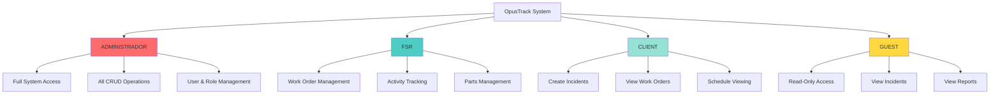
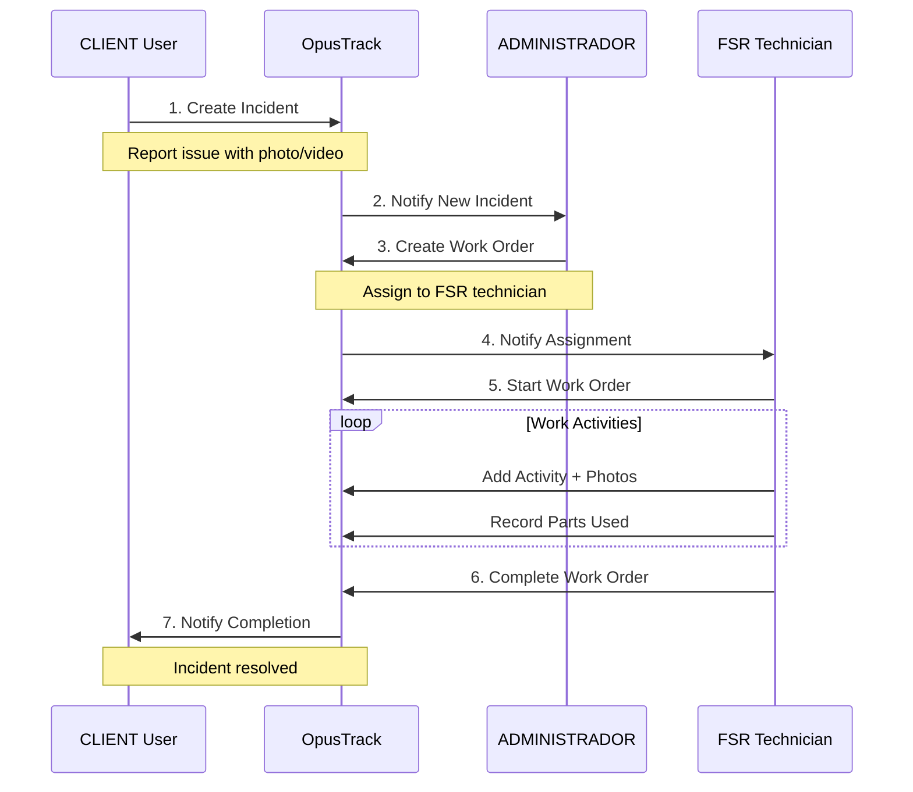
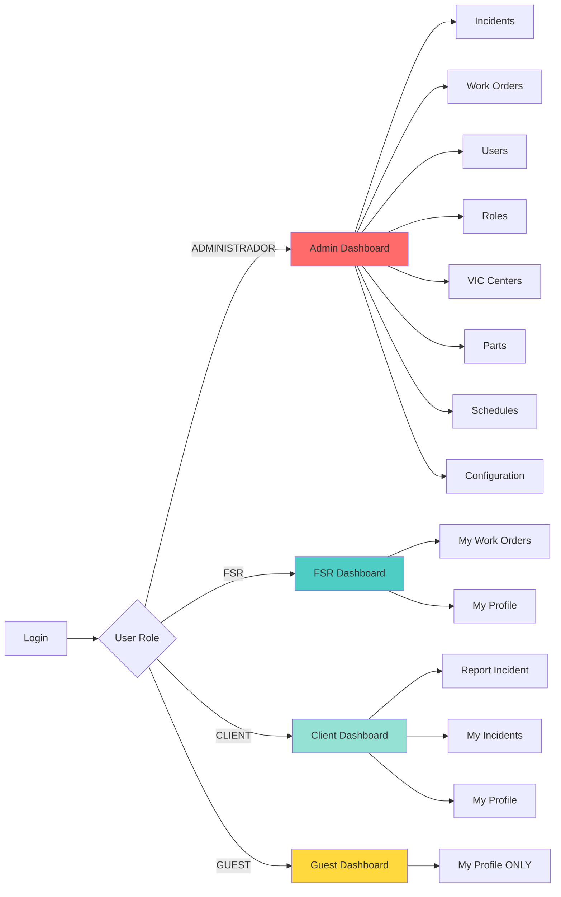
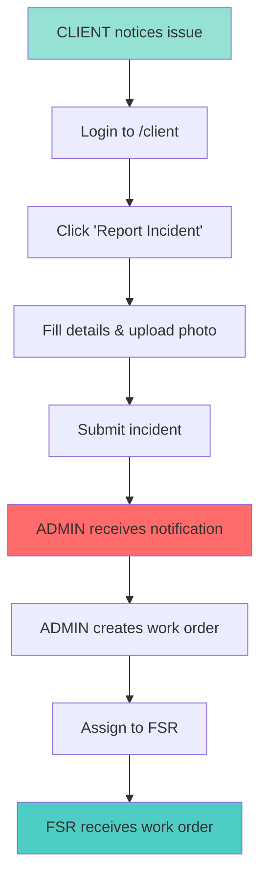
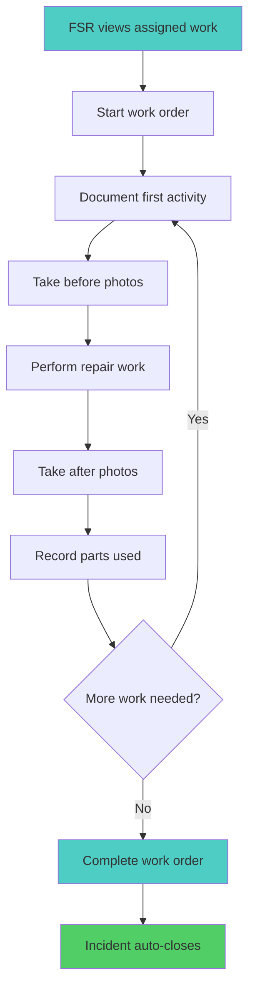
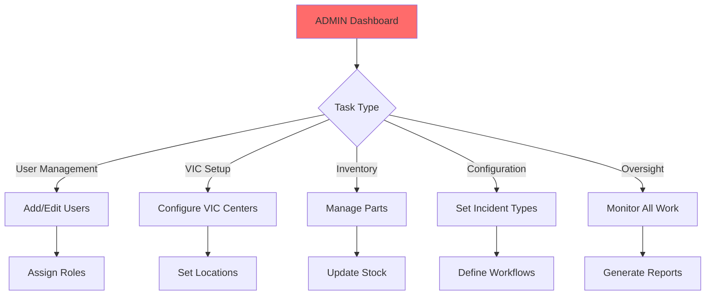

# OpusTrack System Demo Guide

**Vehicle Inspection Center Incident & Work Order Management System**

---

## 🎯 System Overview

OpusTrack is a professional incident management and work order tracking system designed specifically for Vehicle Inspection Centers (VICs) in Mexico. The system provides complete lifecycle management from incident reporting to work order completion.

### Key Features
- 🔒 **Role-Based Access Control** - 4 distinct user roles with granular permissions
- 📱 **Mobile-Friendly** - Responsive design with mobile photo capture
- 📊 **Real-Time Tracking** - Monitor incidents and work orders in real-time
- 📎 **File Attachments** - Upload photos, videos, and documents (HEIC support for iPhone)
- 🔄 **Complete Workflow** - From incident creation to resolution
- 🌓 **Dark/Light Mode** - Theme toggle for better visual experience
- 🔍 **Search & Filters** - Quickly find incidents and work orders
- 📋 **Smart Pagination** - Efficient navigation through large tables

---

## 👥 User Roles & Access Levels



### Role Descriptions

| Role | Access Level | Primary Use Case | VIC Association |
|------|--------------|------------------|-----------------|
| **ADMINISTRADOR** | Full Access | System configuration, user management | ❌ Not VIC-specific |
| **FSR** | Management | Field service, work execution | ✅ Assigned to VIC |
| **CLIENT** | Create & View | Report incidents, track progress | ✅ From specific VIC |
| **GUEST** | Read Only | View-only access, reporting | ❌ Not VIC-specific |

---

## 🔄 System Workflow



---

## 📋 Features by User Role

### 🔴 ADMINISTRADOR (Administrator)

**Dashboard:** `/admin`

**Full System Control** - Complete access to all features

#### Incident Management
- ✅ View all incidents from all VICs
- ✅ Create, edit, delete incidents
- ✅ Assign incidents to FSR technicians
- ✅ Update incident status and priority
- ✅ View complete incident history
- ✅ **Responsive table with pagination** (10/25/50/100 items per page)
- ✅ **Advanced filters** by status, priority, type and VIC
- ✅ **Quick search** by title or description

#### Work Order Management
- ✅ Create work orders from incidents
- ✅ Assign work orders to FSR technicians
- ✅ Monitor work order progress
- ✅ View all activities and parts used
- ✅ Mark work orders as complete
- ✅ **Responsive table** with condensed info on mobile
- ✅ **View attachments** (photos, videos, documents)

#### System Configuration
- ✅ Manage users (create, edit, deactivate)
- ✅ Configure roles and permissions
- ✅ Manage VIC centers
- ✅ Configure incident types and statuses
- ✅ Manage parts inventory
- ✅ Set up schedules
- ✅ **View scheduled incidents** in schedule details
- ✅ **Responsive roles table** with pagination

#### Key Pages
- `/admin` - Main dashboard with statistics
- `/admin/incidents` - All incidents (paginated, responsive table)
- `/admin/work-orders` - All work orders
- `/admin/users` - User management
- `/admin/roles` - Role configuration (with pagination)
- `/admin/vic-centers` - VIC management
- `/admin/parts` - Inventory management
- `/admin/schedules` - Schedule planning
- `/admin/schedules/[id]` - View scheduled incidents for specific date

---

### 🔵 FSR (Field Service Representative)

**Dashboard:** `/fsr`

**Field Operations** - Execute and track work orders

#### Work Order Execution
- ✅ View assigned work orders
- ✅ Start work orders
- ✅ Add work activities with descriptions
- ✅ Upload evidence (photos, videos, documents)
- ✅ Record parts used
- ✅ Complete work orders
- ✅ **Field-optimized interface**

#### Activity Tracking
- ✅ Document all work performed
- ✅ Attach before/after photos
- ✅ Record time spent on activities
- ✅ Update work status in real-time
- ✅ **Improved mobile view** for on-site work

#### Parts Management
- ✅ View available parts
- ✅ Record parts used in repairs
- ✅ Track quantity and costs
- ✅ Update parts inventory

#### Incident Viewing
- ✅ View related incidents
- ✅ Update incident progress
- ✅ Access incident details and history

#### Key Pages
- `/fsr` - Assigned work orders dashboard
- `/fsr/work-orders` - My work orders
- `/fsr/work-orders/[id]` - Execute work order
- `/profile` - Profile management

#### Mobile Features
- 📱 Take photos directly from phone camera
- 📱 HEIC format support (iPhone native format)
- 📱 Upload videos from field
- 📱 Real-time updates while working
- 📱 **Responsive design** optimized for small screens

---

### 🟢 CLIENT (Client User)

**Dashboard:** `/client`

**Incident Reporting** - Report and track issues

#### Incident Creation
- ✅ Create new incidents
- ✅ Describe issue details
- ✅ Set priority level
- ✅ Upload photos/videos of problem
- ✅ Associate with VIC location
- ✅ **Select incident type** from catalog

#### Tracking
- ✅ **View ONLY my reported incidents** (filtered by user)
- ✅ Track incident status
- ✅ View assigned work orders
- ✅ See progress updates
- ✅ View resolution details
- ✅ **Dashboard with personalized statistics**
- ✅ **Summary cards** (Total, Open, In Progress, Closed)

#### Work Orders
- ✅ View work orders related to my incidents
- ✅ See assigned technicians
- ✅ View work activities performed
- ✅ Check parts used and costs

#### Key Pages
- `/client` - My incidents dashboard with statistics
- `/client/new` - Report new incident
- `/client/incidents/[id]` - View incident details

#### Security & Privacy
- 🔒 **Data isolation** - Only sees their own incidents
- 🔒 **User filtering** - Cannot see other clients' incidents
- 🔒 **Specific permissions** - Controlled access to resources

---

### 🟡 GUEST (Guest/Staff)

**Dashboard:** `/guest`

**Read-Only Access** - Limited viewing

#### Current Access
- ✅ View and edit their own profile
- ✅ Change their password
- ✅ Update contact information
- ⚠️ **Limited access** to other functionalities

#### What GUEST Cannot Do
- ❌ View incidents
- ❌ View work orders
- ❌ Access parts inventory
- ❌ View schedules
- ❌ Create or modify any data

#### Use Cases
- Temporary account type for onboarding
- Future expansion for:
  - Management oversight
  - Reporting and analytics
  - Auditing
  - Training and observation

#### Key Pages
- `/guest` - Dashboard with access restriction message
- `/profile` - Profile management (only accessible page)

---

## 🗺️ System Navigation Map



---

## 📊 Complete Permissions Matrix

| Feature | ADMINISTRADOR | FSR | CLIENT | GUEST |
|---------|---------------|-----|--------|-------|
| **Incidents** |
| View Incidents | ✅ All | ✅ All | ✅ Own only | ❌ |
| Create Incidents | ✅ | ❌ | ✅ Own VIC | ❌ |
| Edit Incidents | ✅ | ✅ | ❌ | ❌ |
| Delete Incidents | ✅ | ❌ | ❌ | ❌ |
| Assign Incidents | ✅ | ❌ | ❌ | ❌ |
| Close Incidents | ✅ | ❌ | ❌ | ❌ |
| **Work Orders** |
| View Work Orders | ✅ All | ✅ Assigned | ✅ Related | ❌ |
| Create Work Orders | ✅ | ❌ | ❌ | ❌ |
| Edit Work Orders | ✅ | ✅ Assigned | ❌ | ❌ |
| Delete Work Orders | ✅ | ❌ | ❌ | ❌ |
| Assign Work Orders | ✅ | ❌ | ❌ | ❌ |
| Complete Work Orders | ✅ | ✅ | ❌ | ❌ |
| **Work Activities** |
| View Activities | ✅ | ✅ | ✅ Related | ❌ |
| Create Activities | ✅ | ✅ | ❌ | ❌ |
| Edit Activities | ✅ | ✅ Own | ❌ | ❌ |
| Delete Activities | ✅ | ✅ Own | ❌ | ❌ |
| Upload Files | ✅ | ✅ | ❌ | ❌ |
| **Parts & Inventory** |
| View Parts | ✅ | ✅ | ❌ | ❌ |
| Create Parts | ✅ | ❌ | ❌ | ❌ |
| Edit Parts | ✅ | ❌ | ❌ | ❌ |
| Delete Parts | ✅ | ❌ | ❌ | ❌ |
| Record Parts Used | ✅ | ✅ | ❌ | ❌ |
| **Profile Management** |
| View Own Profile | ✅ | ✅ | ✅ | ✅ |
| Edit Own Profile | ✅ | ✅ | ✅ | ✅ |
| Change Password | ✅ | ✅ | ✅ | ✅ |
| **Users & Configuration** |
| View Users | ✅ | ❌ | ❌ | ❌ |
| Create Users | ✅ | ❌ | ❌ | ❌ |
| Edit Users | ✅ | ❌ | ❌ | ❌ |
| Delete Users | ✅ | ❌ | ❌ | ❌ |
| Manage Roles | ✅ | ❌ | ❌ | ❌ |
| Manage Permissions | ✅ | ❌ | ❌ | ❌ |
| Manage VICs | ✅ | ❌ | ❌ | ❌ |
| **Schedules** |
| View Schedules | ✅ | ✅ | ✅ | ❌ |
| View Incidents in Schedule | ✅ | ❌ | ❌ | ❌ |
| Create Schedules | ✅ | ❌ | ❌ | ❌ |
| Edit Schedules | ✅ | ❌ | ❌ | ❌ |
| Delete Schedules | ✅ | ❌ | ❌ | ❌ |
| **Incident Types** |
| View Types | ✅ | ❌ | ✅ (for creation) | ❌ |
| Create Types | ✅ | ❌ | ❌ | ❌ |
| Edit Types | ✅ | ❌ | ❌ | ❌ |
| Delete Types | ✅ | ❌ | ❌ | ❌ |
| **Reports** |
| View Reports | ✅ | ❌ | ❌ | ❌ |
| Export Reports | ✅ | ❌ | ❌ | ❌ |

---

## 🆕 Recently Implemented Features

### Responsive Tables with Pagination
- ✅ **Configurable pagination** - 10, 25, 50 or 100 items per page
- ✅ **Adaptive columns** - Hide less important columns on mobile
- ✅ **Dropdown menus** - Compact actions on small devices
- ✅ **Text truncation** - Smart handling of long text
- ✅ **No horizontal overflow** - Pages fit within viewport

#### Pages with Improved Tables:
- `/admin/incidents` - Responsive, paginated incidents table
- `/admin/roles` - Roles table with pagination
- `/admin/schedules/[id]` - Scheduled incidents table

### Security & Privacy Improvements
- ✅ **User filtering for clients** - Only see their own incidents
- ✅ **Enhanced permission validation** - Granular access control
- ✅ **Data isolation** - Clients cannot see other clients' data

### Schedule Features
- ✅ **Scheduled incidents view** - See all incidents for a date
- ✅ **Responsive table in details** - Info adapted for mobile devices
- ✅ **Direct navigation** - Links to incident details from schedule

### Interface Improvements
- ✅ **Informative badges** - Clear visual states
- ✅ **Descriptive icons** - Better visual understanding
- ✅ **Loading states** - Visual feedback during operations
- ✅ **Friendly error messages** - Clear information to users

---

## 🔄 Typical Use Case Scenarios

### Scenario 1: New Incident Report



### Scenario 2: FSR Work Execution



### Scenario 3: Admin System Management



---

## 📱 Mobile & File Upload Features

### Supported File Types
- 📷 **Images:** JPEG, PNG, GIF, WebP, **HEIC/HEIF** (iPhone native)
- 🎥 **Videos:** MP4, QuickTime/MOV
- 📄 **Documents:** PDF

### Upload Limits
- **Max File Size:** 10MB per file
- **Max Files:** 10 files per upload
- **Storage:** Vercel Blob (cloud) or Filesystem

### Mobile Capabilities
- Direct camera capture from mobile browser
- Front/back camera selection
- Automatic HEIC to standardized format handling
- Upload from photo gallery
- Real-time progress indication

---

## 🔐 Security Features

### Authentication
- Secure password hashing (bcrypt)
- JWT session tokens (30-day expiration)
- Protected routes with middleware

### Authorization
- Database-driven role-based access control
- Granular permission system
- Route-level protection
- Resource-level access control

### Data Protection
- User status validation (ACTIVO/INACTIVO/SUSPENDIDO)
- Soft deletes for audit trails
- VIC-based data isolation for clients
- Activity logging

---

## 🎨 User Interface Highlights

### Design Features
- 🌓 **Dark/Light Mode** - Theme toggle support
- 📱 **Responsive Design** - Works on all devices
- ♿ **Accessible** - WCAG compliant components
- 🎯 **Intuitive Navigation** - Role-specific dashboards
- 📊 **Real-time Updates** - Live status indicators
- 🎨 **Modern UI** - shadcn/ui components
- 🔍 **Search & Filters** - Quick data access
- 📋 **Smart Pagination** - Efficient navigation through large lists

### Dashboard Views
- **Statistics Cards** - Quick metrics overview
- **Recent Activity** - Latest incidents and work orders
- **Status Badges** - Visual status indicators
- **Action Buttons** - Context-aware controls
- **Search & Filters** - Quick data access
- **Responsive Tables** - Adapt to any screen size

---

## 🚀 Getting Started

### Test Accounts

After database seeding, use these credentials for demo:

```
ADMINISTRADOR
Email: admin@opusinspection.com
Password: password123
Access: Full system control

FSR (Field Service Rep)
Email: fsr@opusinspection.com
Password: password123
Access: Work order execution

CLIENT
Email: client@opusinspection.com
Password: password123
Access: Incident reporting

GUEST
Email: guest@opusinspection.com
Password: password123
Access: Read-only viewing
```

### Demo Flow Recommendation

1. **Start as CLIENT** → Report an incident with photos
2. **Switch to ADMIN** → Create work order and assign to FSR
3. **Switch to FSR** → Execute work, add activities and parts
4. **View as GUEST** → Show read-only access
5. **Return to ADMIN** → Show full system configuration

### Demonstrating New Features

1. **Responsive Tables**
   - Go to `/admin/incidents` or `/admin/roles`
   - Resize window to see adaptive columns
   - Test pagination with different item counts

2. **Schedule with Incidents View**
   - Go to `/admin/schedules`
   - Select a schedule
   - View complete list of scheduled incidents

3. **Client Data Isolation**
   - Login as client
   - Verify only their own incidents are shown
   - Create new incident and verify it appears in their list

---

## 📈 System Statistics Example

| Metric | Description |
|--------|-------------|
| **VICs** | Vehicle Inspection Centers in system |
| **Active Users** | Users with ACTIVO status |
| **Open Incidents** | Incidents not yet closed |
| **Pending Work Orders** | Work orders in progress |
| **Parts in Inventory** | Available parts across all VICs |
| **Completed This Month** | Work orders finished this month |

---

## 🔧 Technical Stack

- **Frontend:** Next.js 15, React, TypeScript
- **Backend:** Next.js API Routes, Server Actions
- **Database:** PostgreSQL + Prisma ORM
- **Auth:** NextAuth.js with JWT
- **Storage:** Vercel Blob / Filesystem
- **UI:** Tailwind CSS 4, shadcn/ui (New York style)
- **Mobile:** Responsive PWA-ready

---

## 📞 Support & Resources

- **Documentation:** `/docs` folder
- **Project Configuration:** `CLAUDE.md`
- **Database Schema:** `prisma/schema.prisma`
- **Environment Setup:** `.env` file

---

## 🎯 Development Commands

### Running the Application
```bash
npm run dev          # Start development server
npm run build        # Build for production
npm start            # Start production server
```

### Code Quality
```bash
npm run lint         # Check code with Biome
npm run format       # Format code with Biome
```

### Database Operations
```bash
npm run db:migrate   # Run Prisma migrations
npm run db:studio    # Open Prisma Studio (database GUI)
npm run db:reset     # Reset database
npm run db:seed      # Seed database with initial data
```

---

*Last Updated: January 2025*
*System Version: MVP 1.0*
*Database-Driven Role-Based Access Control*
